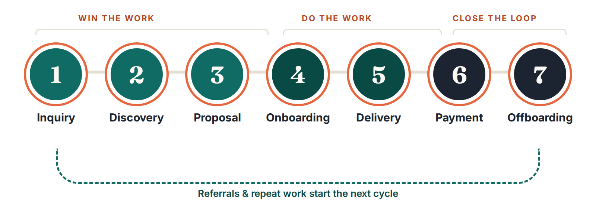

# The client lifecycle system

!!! tip "In this chapter"
    The map that organizes the rest of the book. Each stage of a client relationship has predictable admin, so each stage gets a checklist, templates and prompts.

| Stage | The admin that happens here | Your system (chapter) |
|---|---|---|
| 1. Inquiry | Reply fast, qualify, book a call | Inquiry reply template + booking link (Ch. 5) |
| 2. Discovery | Prepare, take notes, follow up | Call prep sheet + notes-to-summary prompt (Ch. 5) |
| 3. Proposal | Scope, price, send, follow up | Proposal structure + AI draft from notes (Ch. 6) |
| 4. Onboarding | Agreement, deposit, welcome, questionnaire, kickoff | 30-minute onboarding checklist (Ch. 7) |
| 5. Delivery | Updates, meetings, feedback, scope changes | Weekly update template + meeting summaries (Ch. 8) |
| 6. Payment | Invoice, remind, record | Reminder cadence + templates (Ch. 9) |
| 7. Offboarding | Handover, testimonial, referral, archive | Offboarding checklist (Ch. 10) |

**Track the stage of every client in one place.** *The Client Desk* has a **Clients & Pipeline** tab with a stage dropdown and a "next action date" column. Any spreadsheet with the columns *Client, Stage, Next action, Next action date, Project value* and *Notes* works too.

# Workflow 1: Inquiries and discovery calls

!!! tip "In this chapter"
    Reply to new inquiries within one business day with a template you personalize in two minutes. Walk into discovery calls prepared, and send a follow-up summary the same day.

## The inquiry reply

Speed and clarity beat polish here. Your reply should (1) thank them and show you read their message, (2) answer the one question they asked, (3) ask two or three qualifying questions, and (4) offer a clear next step.

!!! example "Template: inquiry reply"
    **Subject:** Re: [their subject], next steps

    Hi [NAME],

    Thanks for reaching out about [ONE-LINE SUMMARY OF THEIR REQUEST]. [ONE SENTENCE THAT SHOWS YOU READ IT, e.g., "Moving from Wix to Squarespace before your spring launch makes sense."]

    To see if I'm the right fit, could you share:

    1. [QUALIFYING QUESTION 1, e.g., "Your ideal launch date?"]
    2. [QUALIFYING QUESTION 2, e.g., "Roughly how many pages?"]
    3. [BUDGET RANGE QUESTION, e.g., "A budget range you have in mind?"]

    If it's easier to talk, you can book a 20-minute call here: [BOOKING LINK].

    [SIGN-OFF]

!!! prompt "LEAD-01 · Reply to a new inquiry"
    Here is my business brief and voice profile: [PASTE]. A potential client sent this inquiry (redacted): """[PASTE INQUIRY]""". Draft a reply under 150 words that: thanks them and references one specific detail from their message; answers any direct question they asked (if I haven't given you the answer, write [NEED INFO] instead of guessing); asks the 2–3 most useful qualifying questions for my services; and ends with my booking link [BOOKING LINK]. Match my voice profile. Don't mention prices unless they asked and my brief includes them.

## Qualifying questions bank

Pick two or three per inquiry. You don't need them all.

- What prompted you to look for help now?
- What does success look like three months after this project is done?
- Is there a date this needs to be finished by, and what drives that date?
- Who else is involved in decisions?
- Have you worked with a [YOUR PROFESSION] before? What went well or badly?
- Do you have a budget range in mind?

## Discovery call prep (10 minutes)

!!! prompt "DISC-02 · Discovery call prep sheet"
    I have a discovery call with a potential client. Here is what I know (redacted): """[INQUIRY + ANY PUBLIC INFO ABOUT THEIR BUSINESS]""". My services: [SERVICES]. Create a one-page call prep sheet with: (1) a 2-sentence summary of what they seem to want; (2) 5 open questions to uncover goals, constraints and decision process; (3) 3 likely objections or risks and how I might address them; (4) what I need to learn to scope the project; (5) a proposed call agenda for [LENGTH] minutes. Flag any assumptions you're making.

## After the call: summary + next steps (same day)

Record your notes during the call (or use a meeting transcription tool **only with the client's knowledge and consent**). Then turn them into a follow-up email.

!!! prompt "DISC-05 · Call notes → summary + next steps email"
    Here are my rough notes from a discovery call (redacted): """[NOTES]""". Using my voice profile [PASTE], write a follow-up email that: thanks them; summarizes their goals, constraints and timeline in 3–5 bullets using their words where possible; lists open questions; states the next step and date (e.g., "I'll send a proposal by [DATE]"); and stays under 200 words. After the email, separately list anything in my notes that is ambiguous or that I should clarify before writing a proposal.

!!! checklist "Workflow 1 checklist"
    - [ ] Inquiry reply template saved in my email app
    - [ ] Booking link created (20–30 minute slot)
    - [ ] Qualifying questions chosen
    - [ ] Call prep prompt saved
    - [ ] Follow-up summary sent the same day as the call
    - [ ] Client added to my tracker at stage "Discovery" with a next-action date

# Workflow 2: Proposals that don't sound generic

!!! tip "In this chapter"
    A proposal structure that sells outcomes, an AI prompt that drafts it from your call notes, a scope-exclusions list that prevents scope creep, and a polite follow-up schedule.

## The seven-part proposal

1. **Their situation**, in their words (from your call summary).
2. **Outcomes**: what will be different when you're done.
3. **Scope**: deliverables as a numbered list.
4. **Not included**: explicit exclusions and assumptions.
5. **Timeline**: milestones, and what you need from them to hit each one.
6. **Investment**: price, payment schedule, and what's included. Many service providers offer two or three options; if you do, make the differences obvious.
7. **Next step**: exactly how to say yes (reply, sign, pay deposit).

!!! prompt "PROP-01 · Proposal draft from discovery notes"
    Here is my business brief [PASTE], my voice profile [PASTE], and my discovery call summary (redacted): """[SUMMARY]""". Draft a proposal using this structure: 1) Your situation (3–4 sentences using the client's words), 2) Outcomes (3–5 bullets), 3) Scope (numbered deliverables), 4) Not included (5–8 bullets), 5) Timeline (milestones with client dependencies), 6) Investment: [PRICE / OPTIONS I'LL PROVIDE]. Use exactly my prices and payment terms and don't invent numbers. 7) Next step. Keep it under 700 words, plain language, no buzzwords. Mark anything you had to assume with [CHECK].

!!! warning "Don't let AI price your work"
    AI doesn't know your costs, your market or your capacity. Set the price yourself, then paste it in. If a draft contains any number you didn't provide, delete it.

## The scope-exclusions list (your best scope-creep defense)

Most scope creep starts with an assumption nobody wrote down. Keep a master list of common exclusions for your service and include the relevant ones in every proposal.

!!! prompt "PROP-06 · Scope exclusions & assumptions list"
    I'm a [PROFESSION] and this project includes: [DELIVERABLES]. List 10 things clients commonly assume are included in this kind of project but often aren't (e.g., extra revision rounds, copywriting, stock photos, hosting, training, ongoing support). For each, write one plain-language line for a "Not included" section and, where useful, the add-on I could offer instead. Then list 5 assumptions about the client's responsibilities (content, feedback times, access) that I should state in the proposal.

## Follow-up schedule

A polite, predictable follow-up is not pushy; it's professional. A simple cadence:

| When | Message |
|---|---|
| Day of sending | Proposal + one-line summary of the next step |
| Day 3 | "Any questions I can answer?" (one sentence) |
| Day 7 | Offer a 15-minute call to walk through options |
| Day 14 | Close the loop: "I'll assume the timing isn't right. Happy to revisit." |

This cadence is a suggested starting point, not a researched benchmark. Adjust it to your clients and industry.

!!! checklist "Workflow 2 checklist"
    - [ ] Proposal template (7 parts) saved as a document
    - [ ] Master exclusions list written for my main service
    - [ ] Prices and payment terms decided by me (not AI)
    - [ ] Follow-up dates added to my tracker when a proposal is sent

# Workflow 3: Onboarding in 30 minutes

!!! tip "In this chapter"
    A checklist that turns "yes!" into a smooth start: agreement, deposit, welcome email, intake questionnaire and kickoff. Most of it is Level 1 (decide once); AI helps personalize.

## The onboarding checklist

!!! checklist "New client onboarding"
    - [ ] Agreement/contract sent and signed (use a professionally reviewed template)
    - [ ] Deposit invoice sent (terms per your agreement)
    - [ ] Welcome email sent (template below)
    - [ ] Intake questionnaire sent
    - [ ] Kickoff call scheduled
    - [ ] Shared folder created with a consistent structure
    - [ ] Tracker updated: stage = Onboarding, next action + date
    - [ ] Communication norms shared (response times, channels, feedback rounds)
    - [ ] Calendar blocked for the first milestone

## The welcome email

!!! example "Template: welcome email"
    **Subject:** Welcome aboard: what happens next

    Hi [NAME],

    I'm really glad we're working together on [PROJECT]. Here's what happens over the next [TIMEFRAME]:

    1. **Paperwork:** your agreement and deposit invoice are in separate emails. Work starts once both are complete.
    2. **Questionnaire:** please fill in this short form by [DATE]: [LINK]. It takes about [MINUTES] minutes.
    3. **Kickoff:** pick a time for our kickoff call: [BOOKING LINK].

    **How we'll work together:** I reply to emails within [RESPONSE TIME] on [WORKING DAYS]. For feedback, I'll ask for one consolidated set of comments per milestone so nothing gets lost.

    Any questions, just reply here.

    [SIGN-OFF]

!!! prompt "ONB-01 · Welcome email"
    Using my business brief and voice profile [PASTE], write a welcome email for a new client (redacted details: """[PROJECT, TIMELINE, LINKS]"""). Include: a warm opening that references the project; a numbered "what happens next" list (agreement, deposit, questionnaire link, kickoff booking link); my communication norms from the brief; and a friendly close. Under 220 words. Use only the links and dates I provide. Use [NEED INFO] for anything missing.

## The intake questionnaire

Ask only what you'll actually use. Send it as a form (Google Forms, Microsoft Forms, Tally or similar) so answers land in one place.

!!! prompt "ONB-03 · Intake questionnaire builder"
    I'm a [PROFESSION] starting a [PROJECT TYPE] for a client. Create an intake questionnaire of 10–15 questions grouped under: Goals & success measures; Audience/customers; Brand & preferences; Content & assets they'll provide; Access & logistics; Communication & approvals. For each question, note why I need it (one line) and mark it Required or Optional. Avoid questions I could answer myself from their website. End with a "Anything else we should know?" question.

## Level 3 option: automate the hand-offs

Once the checklist works manually, a free automation tier can remove the copy-pasting. For example: *form submission → new row in your spreadsheet → notification to you*. As of September 2026, Zapier's free plan includes 100 tasks per month with two-step Zaps, and Make's free plan includes up to 1,000 credits per month with 2 active scenarios.^[6,7]^ Free limits change, so check before building.

!!! checklist "Workflow 3 checklist"
    - [ ] Onboarding checklist copied into my tracker or task app
    - [ ] Welcome email template saved
    - [ ] Intake questionnaire built as a form
    - [ ] Standard folder structure documented
    - [ ] Agreement template reviewed by a professional (one-time)

# Workflow 4: Delivery communication

!!! tip "In this chapter"
    Keep clients confident and informed with a weekly update that takes five minutes, meeting summaries that write themselves, and a calm way to handle scope changes.

## The five-minute weekly update

Clients rarely complain about too much clarity. A short, predictable update prevents "just checking in" emails and surfaces problems early.

!!! example "Template: weekly update"
    **Subject:** [PROJECT]: week of [DATE] update

    Hi [NAME],

    **Done this week:** [2–4 bullets]
    **Next week:** [2–3 bullets]
    **Needed from you:** [items + dates, or "Nothing this week"]
    **Risks / decisions:** [anything that could affect timeline or budget, or "None"]

    [SIGN-OFF]

!!! prompt "DEL-01 · Weekly client update"
    Turn my rough notes into a weekly client update using this structure: Done this week / Next week / Needed from you (with dates) / Risks or decisions. Notes (redacted): """[NOTES]""". Keep it under 150 words, in my voice [VOICE PROFILE]. If my notes mention a delay, state it plainly with the new expected date. Don't soften it into vagueness, and don't invent reasons.

In Sam's (fictional) audit, weekly updates were the highest-scoring task. With a template and this prompt, Sam's process becomes: jot 5 bullets during the week → paste → edit → send.

## Meeting notes to action items

!!! prompt "DEL-04 · Meeting notes → summary & action items"
    Here are notes or a transcript from a client meeting (redacted): """[NOTES]""". Produce: (1) a 3-sentence summary; (2) decisions made; (3) action items as a table with Owner, Task, Due date (write "TBC" if no date was agreed; don't invent dates); (4) open questions. Then draft a short follow-up email to the client that confirms decisions and action items.

!!! warning "Recording and transcription"
    Only record or transcribe calls with the other person's knowledge. Consent rules vary by location. Tell people at the start of the call, and respect a "no".

## Handling scope changes without awkwardness

When a client asks for something outside the agreed scope, the professional move is to **acknowledge, clarify, and quote** before doing the work.

!!! prompt "DEL-07 · Scope change request email"
    A client asked for something outside our agreed scope. Agreed scope: """[SCOPE]""". Their request: """[REQUEST]""". Draft a friendly, confident email that: thanks them for the idea; notes it's outside the current scope (without blaming); offers 2 options, (a) add it now for [PRICE / TIME IMPACT I'LL PROVIDE] or (b) park it for a later phase; and asks them to confirm which option they prefer before I start. Under 170 words, in my voice.

!!! checklist "Workflow 4 checklist"
    - [ ] Weekly update template saved; reminder set for the same day each week
    - [ ] Meeting-summary prompt saved
    - [ ] Scope change email template saved
    - [ ] Consent line for recording prepared ("Do you mind if I record this for my notes?")
